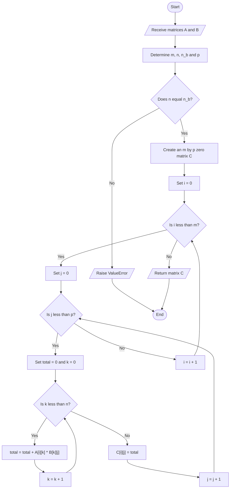

# Matrix Multiplication Flowchart

```mermaid
flowchart TD
    START([Start])
    INPUT[/Receive matrices A and B/]
    SHAPE[Determine m, n, n_b and p]
    DIMENSION{"Does n equal n_b?"}
    ERROR[/Raise ValueError/]
    INITIALISE[Create an m by p zero matrix C]

    SET_I[Set i = 0]
    CHECK_I{"Is i less than m?"}

    SET_J[Set j = 0]
    CHECK_J{"Is j less than p?"}

    SET_K[Set total = 0 and k = 0]
    CHECK_K{"Is k less than n?"}

    MULTIPLY["total = total + A[i][k] * B[k][j]"]
    INCREMENT_K[k = k + 1]

    STORE["C[i][j] = total"]
    INCREMENT_J[j = j + 1]
    INCREMENT_I[i = i + 1]

    OUTPUT[/Return matrix C/]
    END([End])

    START --> INPUT
    INPUT --> SHAPE
    SHAPE --> DIMENSION

    DIMENSION -- No --> ERROR
    ERROR --> END

    DIMENSION -- Yes --> INITIALISE
    INITIALISE --> SET_I
    SET_I --> CHECK_I

    CHECK_I -- No --> OUTPUT
    OUTPUT --> END

    CHECK_I -- Yes --> SET_J
    SET_J --> CHECK_J

    CHECK_J -- No --> INCREMENT_I
    INCREMENT_I --> CHECK_I

    CHECK_J -- Yes --> SET_K
    SET_K --> CHECK_K

    CHECK_K -- Yes --> MULTIPLY
    MULTIPLY --> INCREMENT_K
    INCREMENT_K --> CHECK_K

    CHECK_K -- No --> STORE
    STORE --> INCREMENT_J
    INCREMENT_J --> CHECK_J
```
